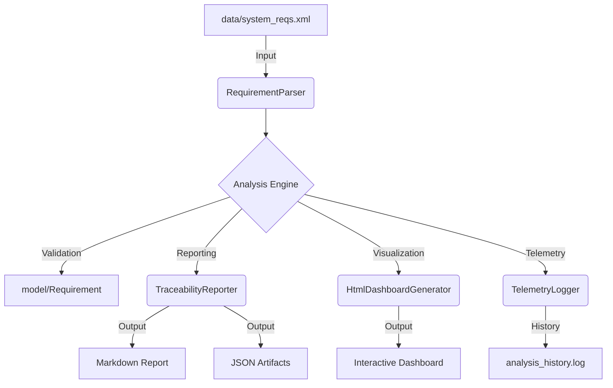

# ReqTrace-Java: Missile Edition
**Automated Requirements Traceability and Risk Analysis Engine**

ReqTrace-Java er et verktøy for statisk analyse og risikovurdering av systemkrav i sikkerhetskritiske prosjekter. Systemet er spesialisert for missilteknologi (Propulsion, Guidance, Warhead) og fungerer som en automatisert valideringsenhet i en moderne DevOps-pipeline.

## Systemarkitektur

Systemet er bygget etter en modulær lagdelt arkitektur for å sikre separasjon av ansvar mellom dataparsing, analyse og rapportering.



## DevOps og CI/CD Pipeline
Prosjektet benytter GitHub Actions og lokale Git Hooks for å sikre kontinuerlig integritet. Hver programvareoppdatering trigger en fullstendig livssyklus-sjekk:

* **Build and Compile:** Verifiserer at kildekoden kompilerer feilfritt med JDK 17.
* **Automated Javadoc:** Genererer tidsstemplede rapporter i /archive for full historisk sporbarhet.
* **Quality Gate:** Automatisk terminering dersom EXTREME RISK detekteres. Dette blokkerer git push frem til risikoen er håndtert.
* **Artifact Management:** Lagrer analyserapporter (.md og .json) som persistente artefakter.

## Funksjonalitet
* **Risk Score Algorithm:** Kategorisering av risiko (EXTREME, HIGH, MEDIUM).
* **Vague Word Detection:** Identifisering av uklare lingvistiske formuleringer som "raskt" eller "sufficient".
* **Formal Compliance:** Verifisering av "Shall"-konvensjonen.
* **Interactive Dashboard:** Visualisering av systemstatus med Chart.js.
* **Telemetry Logging:** Historisk sporing av analyse-data i analysis_history.log.


## Prosjektstruktur
```
├── .github/workflows/    # CI/CD Pipeline konfigurasjon
├── src/
│   ├── Main.java         # System-orkestrator og Quality Gate logikk
│   ├── model/            # Domenemodell og forretningslogikk
│   ├── parser/           # XML data-ingestion moduler
│   └── engine/           # Rapporterings-, Dashboard- og Telemetritjenester
├── data/                 # Kildedata i XML-format
├── archive/              # Historisk arkiv med tidsstemplede rapporter
├── test/                 # Enhetstester for logikkvalidering
└── docs/                 # Automatisk generert teknisk dokumentasjon
```

## Installasjon og Bruk

### Kompilering av systemet
```javac -d bin -sourcepath src src/Main.java```

### Eksekvering av analyse
```java -cp bin Main```

## Se visuelt Dashboard

**Åpne dashboard.html i din nettleser for en grafisk fremstilling av siste analyse.**
