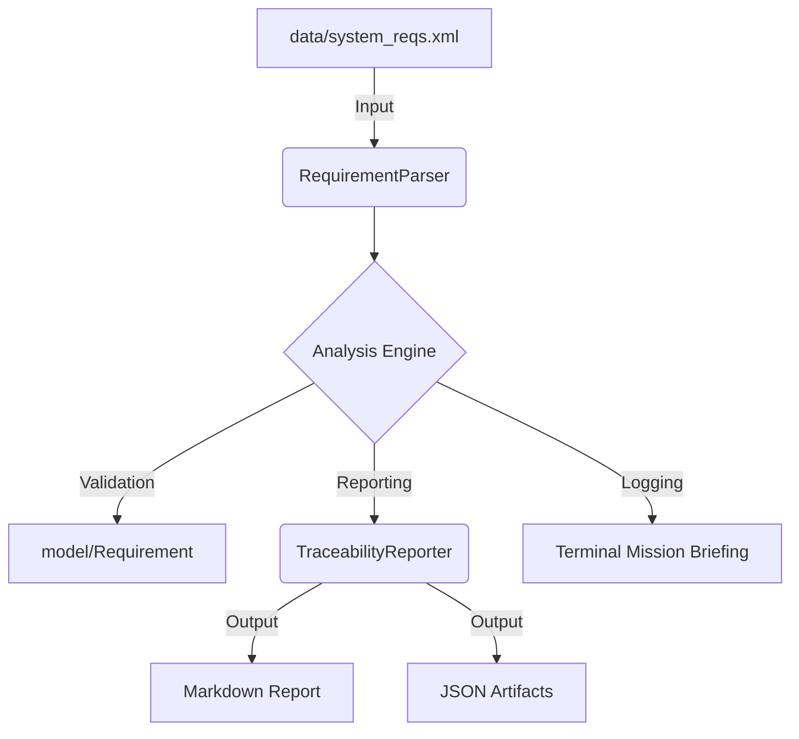

# ReqTrace-Java: Missile Edition
**Automated Requirements Traceability and Risk Analysis Engine**

ReqTrace-Java er et verktøy for statisk analyse og risikovurdering av systemkrav i sikkerhetskritiske prosjekter. Systemet er spesialisert for missilteknologi (Propulsion, Guidance, Warhead) og fungerer som en automatisert valideringsenhet i en moderne DevOps-pipeline.

## Systemarkitektur

Systemet er bygget etter en modulær lagdelt arkitektur for å sikre separasjon av ansvar mellom dataparsing, analyse og rapportering.



## DevOps og CI/CD Pipeline
Prosjektet benytter GitHub Actions for å sikre kontinuerlig integritet. Hver programvareoppdatering trigger en fullstendig livssyklus-sjekk:

* **Build and Compile:** Verifiserer at kildekoden kompilerer feilfritt med JDK 17.
* **Automated Javadoc:** Validerer at all teknisk dokumentasjon følger fastsatte standarder.
* **Unit Testing:** Utfører regresjonstester på algoritmer for risikoberegning.
* **Artifact Management:** Lagrer analyserapporter (.md og .json) som persistente artefakter.

## Funksjonalitet
* **Risk Score Algorithm:** Kategorisering av risiko (EXTREME, HIGH, MEDIUM).
* **Vague Word Detection:** Identifisering av uklare lingvistiske formuleringer.
* **Formal Compliance:** Verifisering av "Shall"-konvensjonen.
* **Subsystem Integrity:** Validering av tekniske komponenter.


## Prosjektstruktur
```
├── .github/workflows/    # CI/CD Pipeline konfigurasjon
├── src/
│   ├── Main.java         # System-orkestrator og status-logging
│   ├── model/            # Domenemodell og forretningslogikk
│   ├── parser/           # XML data-ingestion moduler
│   └── engine/           # Rapporterings- og eksporttjenester
├── data/                 # Kildedata i XML-format
├── test/                 # Enhetstester for logikkvalidering
└── docs/                 # Automatisk generert teknisk dokumentasjon
```

Installasjon og Bruk
Bash
# Kompilering av systemet
```javac -d bin -sourcepath src src/Main.java```

# Eksekvering av analyse
```java -cp bin Main```
